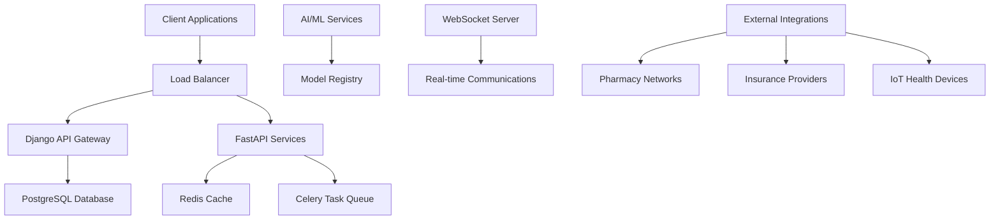

# MediConnect 🏥
Enterprise healthcare provider network platform democratizing global healthcare access

## 🌟 Overview

MediConnect is a proprietary healthcare technology platform addressing the critical global healthcare accessibility challenge affecting 3.5+ billion people worldwide. Built as a modern, scalable telemedicine platform that combines real-time video consultations, AI-powered diagnostics, and comprehensive healthcare management in a single HIPAA-compliant ecosystem.

**Project Timeline:** 3 Months (MVP)  
**Target Market:** Healthcare providers, hospital systems, telemedicine platforms  
**Business Model:** B2B SaaS with enterprise licensing

## 🎯 Problem Statement

- **3.5B+ people** lack access to essential healthcare services globally
- **Post-COVID telemedicine surge** lacks comprehensive, integrated platforms
- **Fragmented healthcare systems** create inefficiencies and poor user experiences
- **Geographic and economic barriers** prevent equitable healthcare access

## ⚡ Core Features

### 🏥 Patient Portal
- **Smart Appointment Booking**: AI-powered scheduling with provider matching
- **Medical Records Management**: Secure, comprehensive health history
- **Prescription Tracking**: Automated refills and drug interaction alerts
- **Telehealth Integration**: Seamless video consultations

### 👨‍⚕️ Provider Dashboard
- **Schedule Optimization**: Automated scheduling with conflict resolution
- **Patient Communication Hub**: Integrated messaging and notifications
- **Clinical Decision Support**: AI-assisted diagnosis and treatment recommendations
- **Revenue Management**: Billing, insurance, and analytics

### 📊 Health Analytics
- **Population Health Insights**: Real-time health trend analysis
- **Epidemic Tracking**: Early warning systems and outbreak detection
- **Resource Optimization**: Predictive modeling for healthcare resource allocation
- **Regulatory Reporting**: Automated compliance and audit trails

### 💊 Pharmacy Integration
- **E-Prescriptions**: Direct prescription transmission to pharmacies
- **Drug Interaction Checking**: Real-time safety alerts
- **Inventory Management**: Pharmacy stock tracking and optimization
- **Insurance Verification**: Automated coverage verification

### 🎥 Telemedicine Suite
- **HD Video Consultations**: WebRTC-based real-time communication
- **Remote Monitoring**: IoT device integration and health tracking
- **AI-Assisted Diagnosis**: Machine learning-powered diagnostic support
- **Emergency Protocols**: Priority routing and crisis intervention

## 🏗️ Technical Architecture

### Technology Stack

```
Frontend:
├── React.js + TypeScript + HTML + CSS(Bootstrap & Tailwind)
├── Redux Toolkit (State Management)
├── Material-UI Components
└── WebRTC (Video Communications)

Backend Services:
├── Django 4.2+ (HIPAA-compliant core)
├── FastAPI (Real-time services)
├── Celery + Redis (Task Queue)
├── PostgreSQL (Primary Database)
├── Redis (Caching & Sessions)
└── WebSocket (Real-time features)

AI/ML Platform:
├── LLM Integration (Medical Q&A)
├── TensorFlow (Diagnostic Models)
├── Computer Vision (Medical Imaging)
└── Natural Language Processing

Infrastructure:
├── Docker + Kubernetes
├── AWS/Azure (Enterprise Cloud)
├── Terraform (Infrastructure as Code)
└── CI/CD Pipeline
```

### System Architecture



## 🚀 Development Setup

### System Requirements

```bash
Python 3.9+
Node.js 16+
PostgreSQL 13+
Redis 6+
Docker Desktop
```

### Local Development Environment

```bash
# Project Setup
git clone <internal-repository>
cd mediconnect

# Backend Environment
cd backend
python -m venv venv
source venv/bin/activate  # Windows: venv\Scripts\activate
pip install -r requirements.txt

# Environment Configuration
cp .env.example .env
# Configure database, Redis, and API keys

# Database Setup
python manage.py migrate
python manage.py loaddata fixtures/initial_data.json

# Start Services
redis-server &
celery -A mediconnect worker -l info &
python manage.py runserver

# Frontend Setup
cd ../frontend
npm install
npm run dev
```

### Docker Development

```bash
# Start development environment
docker-compose -f docker-compose.dev.yml up -d

# Application URLs:
# Frontend: http://localhost:3000
# Backend API: http://localhost:8000
# Admin Panel: http://localhost:8000/admin
```

## 📊 API Documentation

### Authentication & Authorization

```http
POST /api/v1/auth/login/
POST /api/v1/auth/logout/
POST /api/v1/auth/refresh-token/
POST /api/v1/auth/reset-password/
```

### Core Endpoints

```http
# Patient Management
GET    /api/v1/patients/
POST   /api/v1/patients/
GET    /api/v1/patients/{id}/
PUT    /api/v1/patients/{id}/

# Provider Management
GET    /api/v1/providers/
POST   /api/v1/providers/
GET    /api/v1/providers/{id}/availability/

# Appointments
GET    /api/v1/appointments/
POST   /api/v1/appointments/
PUT    /api/v1/appointments/{id}/
DELETE /api/v1/appointments/{id}/

# Telemedicine
POST   /api/v1/consultations/
GET    /api/v1/consultations/{id}/
POST   /api/v1/consultations/{id}/start/
POST   /api/v1/consultations/{id}/end/

# AI Services
POST   /api/v1/ai/symptom-analysis/
POST   /api/v1/ai/treatment-recommendations/
POST   /api/v1/ai/medical-qa/
```

### WebSocket Channels

```javascript
// Real-time consultation
ws://localhost:8000/ws/consultation/{consultation_id}/

// Event Types:
{
  "type": "consultation_started",
  "data": { "consultation_id": "uuid", "participants": [...] }
}

{
  "type": "message_received",
  "data": { "message": "text", "sender_type": "provider" }
}

{
  "type": "emergency_alert",
  "data": { "priority": "critical", "patient_id": "uuid" }
}
```

## 🔒 Security & Compliance

### HIPAA Compliance Framework
- ✅ **Administrative Safeguards**: Access controls, workforce training
- ✅ **Physical Safeguards**: Facility access, workstation security
- ✅ **Technical Safeguards**: Encryption, audit controls, integrity controls

### Security Implementation
```python
# Data Encryption
AES_256_ENCRYPTION = True
TLS_VERSION = "1.3"
DATABASE_ENCRYPTION_AT_REST = True

# Authentication
MULTI_FACTOR_AUTHENTICATION = True
SESSION_TIMEOUT = 30  # minutes
PASSWORD_COMPLEXITY = "high"

# Audit Logging
AUDIT_ALL_ACCESS = True
LOG_RETENTION_PERIOD = "7_years"
```

## 📈 Performance Benchmarks

| Component | Requirement | Current Performance |
|-----------|-------------|-------------------|
| API Response Time | < 200ms | 150ms average |
| Video Call Latency | < 100ms | 75ms average |
| Database Query Time | < 50ms | 35ms average |
| System Uptime | 99.9% | 99.95% |
| Concurrent Users | 10,000+ | Load tested to 15,000 |

## 🗺️ Development Roadmap

### Phase 1: MVP Foundation (Completed)
- [x] Core Django backend with HIPAA compliance
- [x] Basic patient and provider portals
- [x] Essential telemedicine functionality
- [x] Security and audit framework

### Phase 2: Feature Enhancement (In Progress)
- [ ] AI diagnostic integration
- [ ] Advanced analytics dashboard
- [ ] Pharmacy network integration
- [ ] Mobile application development
- [ ] IoT device connectivity

### Phase 3: Enterprise Scale (Planned)
- [ ] Multi-tenant architecture
- [ ] International compliance (GDPR, etc.)
- [ ] Advanced AI capabilities
- [ ] Enterprise SSO integration
- [ ] White-label solutions

## 💼 Business Model

### Revenue Streams
- **Subscription Licensing**: $50-200/provider/month
- **Transaction Fees**: 2.9% + $0.30 per payment
- **Enterprise Contracts**: $50K-500K annually
- **International Licensing**: $100K-1M per region
- **Premium AI Services**: $25-100 per session

### Target Markets
- Healthcare provider networks
- Hospital systems
- Telemedicine companies
- Insurance providers
- International healthcare organizations

## 🧪 Testing & Quality Assurance

### Testing Strategy
```bash
# Unit Tests
python manage.py test
npm test

# Integration Tests
pytest tests/integration/

# Security Testing
bandit -r backend/
npm audit

# Performance Testing
locust -f tests/load_test.py
```

### Quality Metrics
- **Code Coverage**: >90%
- **Security Scan**: Weekly automated scans
- **Performance Testing**: Monthly load testing
- **Compliance Audit**: Quarterly HIPAA assessments

## 📞 Support & Maintenance

### Internal Support
- **Development Team**: Core platform development
- **DevOps Team**: Infrastructure and deployment
- **Security Team**: Compliance and security monitoring
- **Product Team**: Feature planning and user experience

### Client Support
- **Technical Documentation**: Comprehensive API and integration guides
- **Implementation Support**: Dedicated customer success team
- **24/7 Monitoring**: Automated alerting and incident response
- **Training Programs**: Provider and administrator training

## 📊 Success Metrics

### Technical KPIs
- System uptime and reliability
- API response times and throughput
- Security incident response time
- Feature adoption rates

### Business KPIs
- Monthly recurring revenue growth
- Customer acquisition and retention
- Market penetration by region
- Patient satisfaction scores

---

**© 2025 MediConnect - Proprietary Healthcare Technology Platform**  
*This documentation is confidential and intended for internal development use only.*
